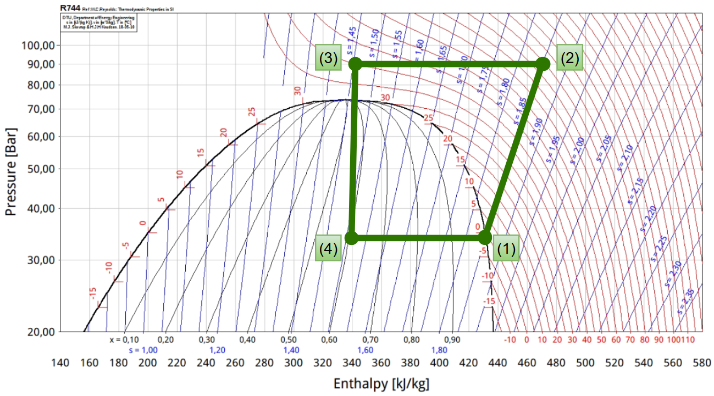

## Rappel de ce qu'est la "thermodynamique"

La thermodynamique concerne l'étude des échanges thermiques/énergétiques entre un système et le milieu extérieur aka. l'univers.

Les systèmes thermodynamiques ouverts concernent ceux qui échangent de la matière (généralement un fluide) avec le milieu extérieur.

La thermodynamique est basée sur plusieurs principes :

- **Le 1er principe de (...) :**
	- Le premier principe stipule que l'énergie totale d'un système isolé est constante. Il peut s'écrire sous la forme :
	$$dE = \delta W + \delta Q$$
	- Le premier principe est un principe de *conservation*. Il est insuffisant pour étudier les systèmes thermodynamiques de matière globale.
- **Le 2e principe de (...) :**
	- Le deuxième principe stipule que l'entropie d'un système isolé ne peut qu'augmenter ou rester constante.
	$$dS = \delta S_{éch}+ \delta S_{cré} \geq 0$$
	- Pour un système isolé, le terme $\delta S_{éch}$ est nul, donc $dS = \delta S_{cré} \geq 0$.
	- Le deuxième principe est un principe d'*évolution*. Il permet de déterminer le sens d'évolution d'un système lors d'une transformation.
Une grandeur conservative reste constante pour un système isolé.
- L'énergie totale est une grandeur conservative.
- L'énergie interne et l'entropie n'en sont pas.
- La masse est une grandeur conservative.

>[!NOTE] Système isolé
> Quand on parle de "système isolé", on parle de système sans échange thermique, mécanique ou de matière avec le milieu extérieur.

Un grandeur extensive/additive est additionnée lors de l'union de deux systèmes pour former un nouveau système global.
$$\Sigma = A \cup B \implies X_\Sigma = X_A + X_B$$

Pour utiliser le premier et second principe pour l'étude d'un système ouvert, il faut définir un nouveau système $\Sigma^*$ qui est défini à deux instants $t$ et $t+dt$ pour contenir la masse entrante $dm_e$ et la masse sortante $dm_s$ (qui seront généralement égales pour un système en régime permanent).

Le système $\Sigma^*$ est donc un système fermé, et on peut appliquer les principes de la thermodynamique à ce système.

---

## Exercice 1
*Questions de cours - Ignoré*

## Exercice 2
1. **Rappel du premier principe pour un fluide en écoulement stationnaire :**
   $$\begin{align*}
   d(H+E_c+E_p) &= \delta W + \delta Q \\
   \implies (dh+de_c+de_p) &= \delta w + \delta q \\
   \implies D \times (dh+de_c+de_p) &= D \times (\delta w + \delta q) \\
   \implies D(dh+de_c+de_p) &= \frac{dm}{dt}\delta w_u + \frac{dm}{dt}\delta q \\
   \implies (dh+de_c+de_p)D &= P_u + P_{th}
   \end{align*}$$
**Rappel de l'expression du deuxième principe pour un fluide en écoulement stationnaire :**
$$\begin{align*}
dm\cdot ds &= \delta S_{éch} + \delta S_{cré} \\
\implies dm\cdot ds &= \frac{\delta Q}{T_0} + \delta S_{cré} \\
\text{Or on sait que : } \delta Q &= P_{th} dt \\
\implies dm\cdot ds &= \frac{P_{th} dt}{T_0} + \delta S_{cré} \\
\implies \frac{dm}{dt} ds &= \frac{P_{th}}{T_0} + \frac{\delta S_{cré}}{dt} \\
\implies D(s_2-s_1) &= \frac{P_th}{T_0} + \dot\sigma
\end{align*}$$

$\dot\sigma$ représente le taux de création d'entropie, soit $\frac{dS_{cré}}{dt}$, aussi noté $\sigma^{cre}$.

2. **Commentaires sur les échanges entre le gaz et l'extérieur :**

On remarque que $T_1 > T_0$ et $T_2 > T_0$ donc le gaz cède de la chaleur à l'extérieur donc $P_{th} < 0$.

(Énoncé) Les variations d'énergie cinétique étant négligées et les variations d'énergie potentielle étant nulles (turbine horizontale), on a donc $de_c \approx 0$ et $de_p = 0$.

Le premier principe devient donc :
$$D(h_2-h_1) = P_u + P_{th}$$

Le gaz est considéré comme un gaz parfait, donc on peut utiliser la relation $dh = c_p dT$ pour réécrire le premier principe :
$$D c_p (T_2-T_1) = P_u + P_{th}$$

La puissance cédée utile/récupérable est donc :
$$\begin{align*}
P_{cédée} &= -P_u \\
&= D c_p (T_1-T_2) - |P_{th}| \\
&= D c_p (T_1-T_2) + P_{th}
\end{align*}$$

$P_{cédée}$ est maximale quand $P_{th}$ est minimale, c'est-à-dire quand la transformation est adiabatique réversible, donc $\dot\sigma = 0$.

3. **Variation d'entropie entre l'entrée et la sortie :**
$$\Delta s = s_2 - s_1 = \frac{\gamma R}{(\gamma - 1)M}\ln\left(\frac{T_2}{T_1}\right)-\frac{R}M\ln\left(\frac{P_2}{P_1}\right)$$

Après application numérique : $\Delta s = -2 \text{kJ}\cdot\text{K}^{-1}\cdot\text{kg}^{-1}$

L'écoulement est adiabatique, donc $\Delta s = \frac{\dot\sigma}{D} \implies \Delta s \ge 0$.

Il y a donc une contradiction. L'hypothèse d'un écoulement adiabatique est donc fausse. Il y a donc un transfert de chaleur vers l'extérieur.

4. **Puissance cédée à la turbine en la supposant réversible :**

On a $P_{cédée} = D c_p (T_1-T_2) + P_{th}$.

Or la transformation est réversible, donc $\dot\sigma = 0$ et $P_{th} = DT_0\Delta s$.
$$\implies P_{cédée} = D c_p (T_1-T_2) + DT_0\Delta s$$

Application numérique : $P_{cédée} = -600,5 \text{kW}$

5. **Vitesse du fluide à l'entrée et à la sortie et commentaire sur la négligence des variations d'énergie cinétique :**

$$\begin{align*}
\text{On a : } D &= \rho v \Sigma \\
\implies \rho_1 v_1 \Sigma &= \rho_2 v_2 \Sigma \\
\implies v_2 &= \frac{D}{\rho_1 \Sigma} \text{ et } v_1 = \frac{D}{\rho_2 \Sigma}
\end{align*}$$

On a $PV = nRT$ donc :
$$P = \frac{\rho}{M}RT \implies \rho = \frac{PM}{RT}$$
$$\implies v_1 = \frac{D}{\Sigma}\frac{RT_1}{P_1M} \text{ et } v_2 = \frac{D}{\Sigma}\frac{RT_2}{P_2M}$$

Après application numérique, on trouve :
- $v_1 = 0,52 \text{ m/s}$
- $v_2 = 1,72 \text{ m/s}$

On calcule la variation d'énergie cinétique massique :
$$\Delta e_c = \frac{v_2^2-v_1^2}{2} = 1,35 \text{ J/kg}$$

Calculons la puissance cinétique (uniformisation des grandeurs) :
$$P_c = D \Delta e_c = 0,00135 \text{ kW} = 1,35 \text{ W}$$

On a bel et bien $P_c \ll P_{cédée}$ donc la négligence des variations d'énergie cinétique est justifiée.

## Exercice 3

1. **Expression de la température $T_2$ en sortie du compresseur en fonction du taux de compression et de la température d'entrée $T_0$**

On sait que la transformation est adiabatique et réversible. On applique donc les **lois de Laplace** :
$$\begin{align*}
PV^\gamma = \text{cte} &\implies P\cdot \frac{T^\gamma(MR)^\gamma}{P^\gamma} = \text{cte} \\
&\implies T^\gamma P^{1-\gamma} = \text{cte} \\
&\implies P_0^{1-\gamma}T_0^\gamma = P_2^{1-\gamma}T_2^\gamma \\
&\implies T_2 = T_0 \left(\frac{P_2}{P_0}\right)^{\frac{\gamma-1}{\gamma}} = T_0 \beta^{\frac{\gamma-1}{\gamma}}
\end{align*}$$

2. **Expression du travail reçu par le fluide :**

...

5. **Calcul de $T_1$ et $T_2'$ dans le cas du compresseur optimisé et comparaison avec la temperature $T_2$ obtenue précédemment :**

Dans les étages BP et HP, les transformations sont adibatiques, alors on a :
$$\begin{cases}
T_1 = T_0 \cdot \beta_1^{\frac{\gamma-1}{\gamma}} \text{ (Q1)}\\
T_2' = T_0 \cdot \beta_2^{\frac{\gamma-1}{\gamma}}
\end{cases}$$

Après application numérique, on trouve que : $T_1 \approx 432,4 \text{ K}$ et $T_2' \approx 432,4 \text{ K}$. ($\beta_1$ et $\beta_2$ sont égales, alors (...))

**Comparaison avec la température du compresseur monoétagé :** $T_2 = T_0\left(\frac{P_2}{P_0}\right)^{\frac{\gamma-1}{\gamma}} \approx 625 \text{ K}$

On constate que $T_2' < T_2$. L'utilité du compresseur étagé est de réduire la température de sortie du compresseur. Cela permet d'éviter d'endommager les pièces du compresseur.

6. **Calcul du travail indiqué par le compresseur étagé optimisé et comparaison au travail dépensé par le compresseur monoétagé :**

Le nouveau travail dépensé est donné par :
$$W' = \frac{2\gamma r}{\gamma - 1}\left((5)^{\frac{\gamma-1}{\gamma}}-1\right) \approx 318 \text{ J}$$

Le travail dépensé par le compresseur monoétagé est donné par :
$$W = C_pT_0((2r^{\frac{\gamma-1}{\gamma}})-1) \approx 411 \text{ J}$$

On remarque encore une fois que $W' < W$. L'utilité du compresseur étagé est de réduire le travail dépensé par le compresseur. On gagne $93$ Joules, soit une réduction de $22,6\%$ du travail dépensé.

## Exercice 4

*La transformation 3-4 est une transformation isenthalpique, et plus précisément une détente de Joule-Thomson. Le travail de transvasement $\Delta (PV)$ compense la variation d'énergie interne, et donc $\Delta H =0$.*
<!-- à revoir parce que je suis con 😍😍😍 -->

2. Le cycle est parcouru dans le sens horaire.

3. $q_f = \Delta h_{4 \to 1} = h_1 - h_4$ et $w_{comp} = h_2 - h_1$.

Après application numérique, on trouve que :
$$\begin{cases}
q_f \approx 90 \text{ kJ/kg} \\
w_{comp} \approx 40 \text{ kJ/kg}
\end{cases}$$

4. **Calcul de l'efficacité et commentaires sur une amélioration possible :**
L'efficacité est donnée par :
$$e = \frac{q_f}{w_{comp}} \approx 2,25$$

Pour améliorer l'efficacité, on peut augmenter la durée de la transformation $2 \to 3$ pour que $q_f$ augmente.

## Exercice 5

1. **Définition de l'énergie totale d'un système thermodynamique :**

L'énergie totale d'un système thermodynamique est la somme de l'énergie interne, de l'énergie cinétique et de l'énergie potentielle :
$$E = E_t + E_p + U$$

2. **Premier principe de la thermodynamique pour un système fermé :**
$$\Delta E_t = \delta W + \delta Q$$

3. 1. **Démonstration à partir du bilan de masse de la formule souhaitée :**

On pose $m(S(t)) = dm_1 + m_v$. À l'instant $t+dt$, on a $m(S(t+dt)) = dm_2 + m_v$. Le système est en régime permanent, donc $m(S(t)) = m(S(t+dt))$.

On a donc $dm_1 = dm_2 = \delta m$. Ce qui implique que $\rho_1\Sigma_1 w_1dt = \rho_2\Sigma_2 w_2dt$. CQFD.

3. 2. **Établissement de la relation demandée :**

À l'instant $t$, on a :
$$E(t) = E(v)+E(dm_1)$$
$$\begin{align*}
\text{Avec : } E(dm_1) &= E_c(dm_1)+E_p(dm_1)+U(dm_1) \\
&= \frac12 dm_1 w_1^2 + dm_1 g z_1 + U(dm_1) \\
&= dm_1\left(\frac12 w_1^2 + g z_1 + u_1\right)
\end{align*}$$

À l'instant $t+dt$, on a :
$$E(t+dt) = E(v)+E(dm_2)$$
$$\begin{align*}
\text{Avec : } E(dm_2) &= E_c(dm_2)+E_p(dm_2)+U(dm_2) \\
&= \frac12 dm_2 w_2^2 + dm_2 g z_2 + U(dm_2) \\
&= dm_2\left(\frac12 w_2^2 + g z_2 + u_2\right)
\end{align*}$$

D'après le premier principe de la thermodynamique, on a :
$$E(t+dt) - E(t) = \delta W + \delta Q$$
$$\implies E(dm_2) - E(dm_1) = \delta W + \delta W' + \delta Q$$
$$\implies dm_2\left(\frac12 w_2^2 + g z_2 + u_2\right) - dm_1\left(\frac12 w_1^2 + g z_1 + u_1\right) = \delta W + \delta W' + \delta Q$$

Calculons $\delta W'$ :
$$\delta W' = P_1\delta V_1 - P_2\delta V_2 = dt(P_1\Sigma_1 w_1-P_2\Sigma_2 w_2)$$

On trouve donc :
$$\delta m\left[\frac12 w^2 + gz_2 + u_2 + P_2\Sigma_2 w_2 - \left(\frac12 w_1^2 + gz_1 + u_1 + P_1\Sigma_1 w_1\right)\right] = \delta W + \delta Q$$
On simplifie $u_i + P_i\Sigma_i w_i = h_i$ sachant que $P_i\Sigma_i w_i = P_i v_i = Pv = \frac{P}{\rho} = \frac{P}{\frac{PM}{RT}} = \frac{RT}{M}$.

On trouve enfin :
$$\delta m\left[\left(\frac12 w_2^2 + gz_2 + h_2\right) - \left(\frac12 w_1^2 + gz_1 + h_1\right)\right] = \delta W + \delta Q$$

3. 3. **Définition des conditions expérimentales qui permettent de faire subir au fluide une détente de Joule Thomson (isenthalpique) :**

- $\delta Q = 0$ (adiabatique)
- $\delta W = 0$ (pas de machine dans l'écoulement)
- $W_1 \approx W_2 \approx 0$ (écoulement lent)
- $z_1 = z_2$ (écoulement horizontal)

Dans ces conditions, on a bien $h_1 = h_2$.

## Exercice 6

1. **Relation que vérifient $M$,$w_1$,$w(x)$,$H_1$,$H(x)$ :**

* L'écoulement est horizontal, donc $\Delta z = 0$.
* L'écoulement est adiabatique donc $\delta Q = 0$.
* Il n'y a pas de travail utile donc $\delta W = 0$.
* L'écoulement est stationnaire donc $\frac{dm}{dt} = D = \text{cte}$.

On trouve donc $\delta m \left(\frac12 w^2 + h(x)\right) = \delta m \left(\frac12 w_1^2 + h_1\right)$.

D'où :
$$\left(\frac12 w^2 + h(x)\right) - \left(\frac12 w_1^2 + h_1\right) = 0$$

Et on a $h = \frac HM$. Donc : $\frac12 w^2(x) + \frac{H(x)}{M} - \left(\frac12 w_1^2 + \frac{H_1}{M}\right) = 0$.

D'où :
$$\boxed{\frac M2\left(w^2(x) - w_1^2\right) + H(x) - H_1 = 0}$$

2. **Démonstration de la relation souhaitée :**
La détente est adiabatique réversible. La variation d'entropie est donc nulle ; $\Delta S = 0$.

En utilisant la deuxième identité thermodynamique :
$$dH = TdS + VdP$$
$$\implies dH = V\cdot dP$$
On sait que $M = \rho V$.
$$\implies dH = \frac{M}{\rho(x)}dP$$
$$\implies H(x) - H_1 = \int_{P_1}^{P(x)} \frac{M}{\rho} dP$$

On trouve donc la relation souhaitée :
$$\boxed{\frac12 w^2(x) -\frac12 w_1^2 + \int_{P_1}^{P(x)} \frac{dP}{\rho} = 0}$$

3. 1. **Expression de $w^2(x)$ en fonction de $w_1$,$C_p$,$T_1$,$M$,$\gamma$ et $\varepsilon$ :**

La transformation est adiabatique, réversible et le gaz est parfait. On peut donc utiliser les lois de Laplace :
$$\begin{align*}
PV^\gamma &= \text{cte} \\
\implies P\cdot\rho^{-\gamma} &= \text{cte} \\
\implies P_1\cdot\rho_1^{-\gamma} &= P(x)\cdot\rho(x)^{-\gamma} \\
\implies \rho(x) &= \rho_1\left(\frac{P(x)}{P_1}\right)^{\frac{1}{\gamma}}
\end{align*}$$

En posant $\varepsilon = \frac{P(x)}{P_1}$, on a donc $\rho(x) = \rho_1\varepsilon^{\frac{1}{\gamma}}$.

En réinsérant dans la relation précédente, on trouve :
$$\frac12 w^2(x) - \frac12 w_1^2 + \int_{P_1}^{P(x)} \frac{dP}{\rho_1\varepsilon^{\frac{1}{\gamma}}} = 0$$
$$\implies \frac12 w^2(x) - \frac12 w_1^2 + \frac{1}{\rho_1}\int_{P_1}^{P(x)} \varepsilon^{-\frac{1}{\gamma}} dP = 0$$
Et on a aussi :
$$\int_{P_1}^{P(x)} \frac{dP}{\rho(x)} = \frac{P_1\gamma}{\rho_1(\gamma-1)}\left(\varepsilon^{\frac{\gamma-1}{\gamma}}-1\right) = \frac{C_pT_1}{M}\left(\varepsilon^{\frac{\gamma-1}{\gamma}}-1\right)$$
On trouve donc :
$$\boxed{w^2(x) = w_1^2 - \frac{2C_pT_1}{M}(1-\varepsilon^{\frac{\gamma - 1}{\gamma}})}$$

3. 2. **Débit massique $q_m$ du gaz à l'abscisse $x$ en fonction de $\rho_1, \varepsilon, \gamma, \Sigma(x)$ et $w(x)$ :**

On sait que $q_m = \rho(x) \Sigma(x) w(x)$ et $\rho(x) = \rho_1\varepsilon^{\frac{1}{\gamma}}$ et que $w(x) = \sqrt{\frac{2C_pT_1}{M}(1-\varepsilon^{\frac{\gamma - 1}{\gamma}})}$.

On trouve donc :
$$\boxed{q_m = \rho_1\varepsilon^{\frac{1}{\gamma}}\Sigma(x)\sqrt{\frac{2C_pT_1}{M}(1-\varepsilon^{\frac{\gamma - 1}{\gamma}})}}$$

On pose $\rho_1\sqrt{\frac{2C_pT_1}{M}} = k_1$ et $\varepsilon^{\frac{1}{\gamma}}\sqrt{1-\varepsilon^{\frac{\gamma - 1}{\gamma}}} = f(\varepsilon)$ pour la suite.

3. 3. 1. **Preuve de l'écriture du débit massique avec explicitation de $k_1$ et $f(\epsilon)$ :**

On a $f(\varepsilon) = \varepsilon^{\frac{1}{\gamma}}\sqrt{1-\varepsilon^{\frac{\gamma - 1}{\gamma}}}$.

On dérive pour trouver le maximum de $f(\varepsilon)$ :
$$f'(\varepsilon) = \dots$$
Après calculs, on trouve que $\varepsilon_0 = \left(\frac{\gamma+1}{2}\right)^{\frac{\gamma}{1-\gamma}}$ est le maximum de $f(\varepsilon)$.

En étudiant les limites, on trouve que $\lim_{\varepsilon \to 0} f(\varepsilon) = 0$ et $\lim_{\varepsilon \to +\infty} f(\varepsilon) = 0$, ce qui confirme que $\varepsilon_0$ est bien le maximum de $f(\varepsilon)$ *(oui fallait le dire avant...)*

3. 3. 2. 1. **Si $\frac{P_2}{P_1} > \varepsilon_0$, alors la tuyère est convergente**$

[...]

3. 3. 2. 2. **Si $\frac{P_2}{P_1} < \varepsilon_0$, alors la tuyère est convergente-divergente**$

[...]

3. 3. 3. : Applications numériques. $w_0 = 818~\mathrm m\cdot \mathrm s^{-1}$ et $P_0 = 10,6~\text{bar}$.

## Exercice 7

